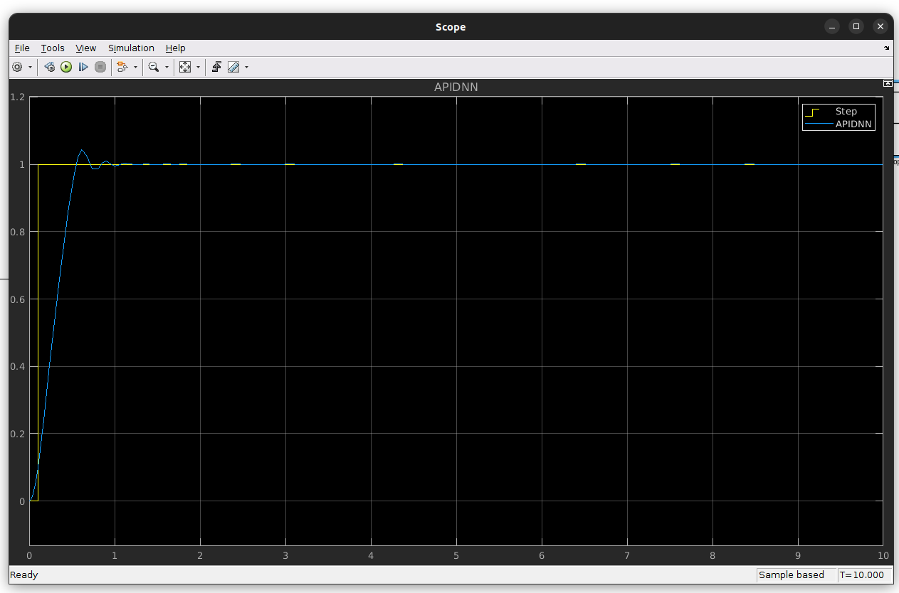
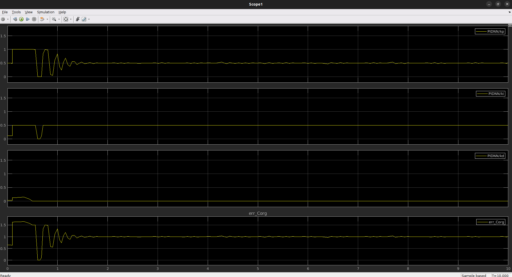
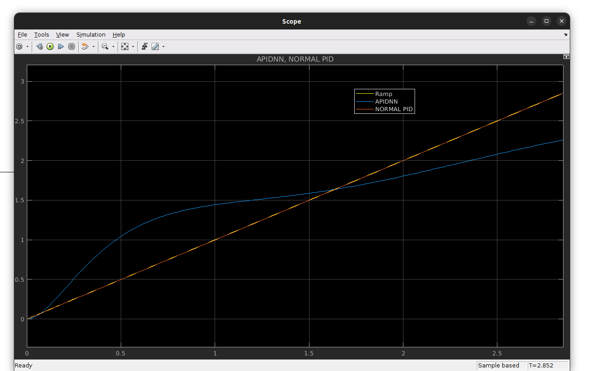
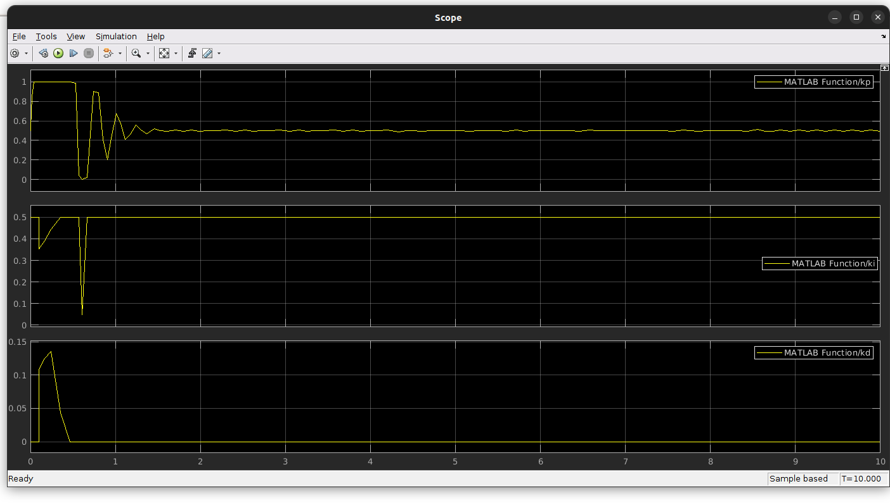

## Tuning PID controller with Neural Network for manipilateur Robot 3DDL
in this repo we create an adaptive PID with neural network to correct erreur in real time and we focus in this project on robotic manipulator Arm with 3DDL

#Nerual Network tested with second order system

## 1- result for step 
 
## 1-1 PID parameter adjusting result
 

# 2-1 result for Ramp
 
## 2-2 PID parameter adjusting result
 

## Contributing

read [contribution guidelines](https://github.com/misarb/SpiderKDP/blob/master/CONTRIBUTING.md)

## TO DO
- [ ] ARM 3DDL modeling
- [ ] Documentation
 

# Contact
E-mail : lahcen.boulbalah@gmail.com
